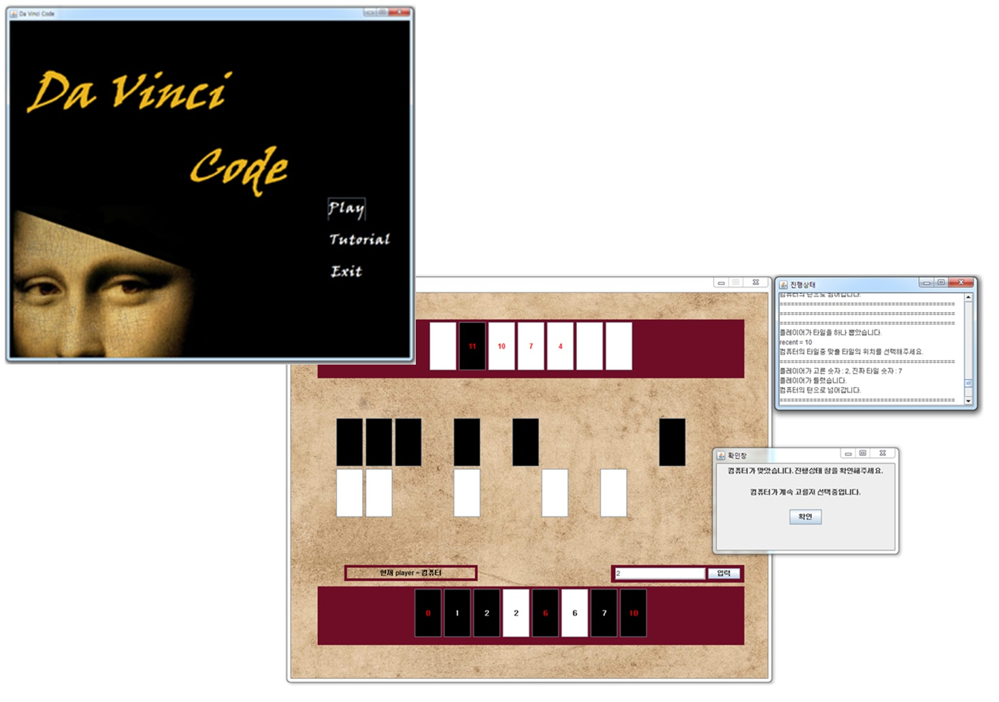

# DavinciCode2017
# 기간
    2개월 (2017-10-10 ~ 2017-12-04)
# 개요
    일종의 추리게임에 속하는 보드 게임인 다빈치코드를 구현하여 여러 명이 플레이하는 게임을 시간과 장소에 
    구애받지 않고 1인이 즐길 수 있도록 합니다. 정하둔 룰에 따라 상대방 플레이어(컴퓨터)와 게임을 진행합니다.
# 사용한 라이브러리 및 구현 환경
    1. 구현 환경
        - Window 7
        - eclipse
        - Java
    2. 사용한 라이브러리 및 기능
        - Java Swing 라이브러리로 GUI 구현
# 필요 기능과 과정
    1. 다빈치코드 게임의 룰에 따른 게임 구현
    2. 컴퓨터와 게임을 하기 위한 컴퓨터가 답을 맞추는 메소드 구현
    3. UI : 사용자에게 보여질 화면(상대방 타일, 본인 타일, 남은 타일)
        - Java Swing 라이브러리를 사용해 JPanel 및 JFrame으로 구현
        
# 구현 화면

